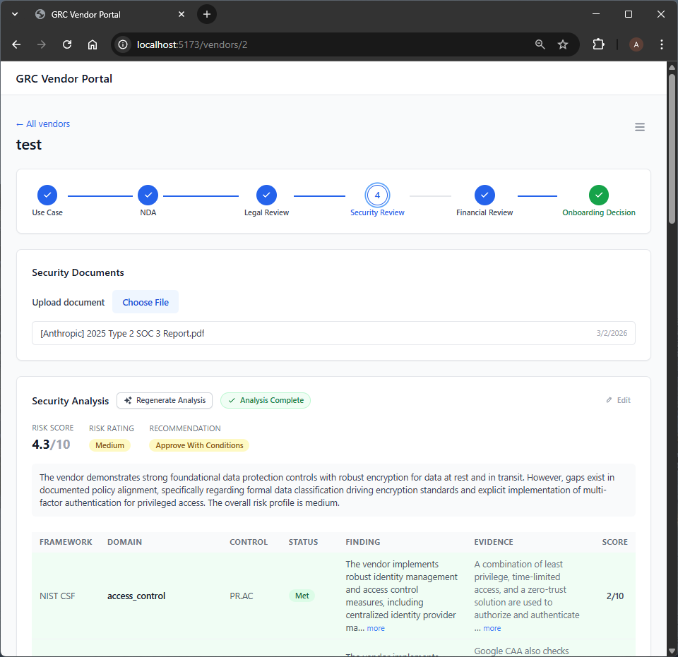

<h1 align="center">AI Vendor Onboarding Orchestrator</h1>

<p align="center">
  <b>Governance, Risk, and Compliance Workflows for humans and AI agents.</b><br/>
  Automates legal, security, and financial risk analysis — so analysts spend time deciding, not researching.
</p>

<p align="center">
  <a href="https://github.com/AlexPerrin/GRC-AI-Automation/blob/main/LICENSE">
    
  </a>
  
  
</p>

Vendor onboarding in security-conscious organizations is slow by design — it has to be. A GRC analyst must manually read through legal agreements, security questionnaires, and financial disclosures, synthesize findings across multiple regulatory frameworks (PIPEDA, GDPR, CPPA, SOC 2, PCI DSS), and coordinate across Product, Legal, Security, and Finance teams — all before a decision can be made. No shared context layer exists between reviewers. Findings aren't cited. Decisions aren't auditable. At most organizations, this process takes weeks.

This system compresses that timeline to hours without removing human judgment from the process.

A GRC analyst uploads vendor documents — NDAs, SOC 2 reports, privacy policies, financial disclosures — and the pipeline automatically runs four parallel due diligence stages. Each AI-powered stage uses RAG (Retrieval-Augmented Generation) to ground its analysis simultaneously in the vendor's submitted materials and an internal knowledge base of compliance frameworks. The analyst receives structured findings with per-criterion assessments, specific evidence citations pulled from the vendor's own documents, identified control gaps, and a recommended posture. Not raw text to wade through — a structured brief ready for a decision.

**What the analyst can now do that they couldn't before:** Review a complete, cited, multi-framework risk assessment for a vendor in under an hour, across legal, security, and financial dimensions — without reading a single raw document themselves. The analyst's role shifts entirely from researcher to decision-maker.

**What AI is responsible for:** Ingesting and parsing vendor documents; chunking, embedding, and indexing content into a vector store; retrieving relevant passages against targeted compliance queries; cross-referencing vendor claims against regulatory requirements and internal control frameworks; generating structured findings with evidence citations; and maintaining a complete, append-only audit trail of every analysis and decision in the workflow.

**Where AI must stop:** The final approval decision — APPROVE, APPROVE WITH CONDITIONS, or REJECT — is reserved for the human analyst at every stage. This is a hard constraint. AI analysis can be wrong; vendor documents can be misleading; and the regulatory and financial consequences of onboarding a non-compliant vendor flow downstream to real audit findings and liability. A human signature on an approval is also a human accepting accountability. Automating that decision away would eliminate the organizational incentive to scrutinize the AI's output carefully — which is the only mechanism that keeps the system honest.

**What breaks first at scale:** Retrieval quality. As the internal knowledge base grows and vendor document volume increases, naive cosine-similarity retrieval surfaces less relevant context per query. The next investment is hybrid retrieval (dense + sparse), cross-encoder re-ranking, and tighter knowledge base curation by domain experts. Prompt and rubric drift — where AI outputs gradually shift as the underlying model updates — is the second-order failure mode, and requires version-pinning model and prompt versions in the audit log.

## Demo



# Getting Started

**Prerequisites:** Docker and Docker Compose.

```bash
git clone git@github.com:AlexPerrin/GRC-AI-Automation.git
cd GRC-AI-Automation
docker compose up --build
```

Open `.env` and set `LLM_PROVIDER_API_KEY` to your Anthropic, OpenAI, or OpenRouter API key. The `LLM_PROVIDER` and `LLM_MODEL` variables have working defaults (`anthropic` / `claude-sonnet-4-6`) — change them only if you want to use a different provider.

Optionally, seed three pre-built vendor scenarios (clean pass, legal rejection, conditional approval) to explore the full workflow without uploading real documents:

```bash
curl -X POST http://localhost:8000/dev/seed
```

The app is running at [`http://localhost:5173`](http://localhost:5173)

## Documentation

| Resource | Link |
|---|---|
| Problem Definition & Background | [Wiki → Problem Statement](../../wiki/Project-Plan) |
| Solution Design & Architecture | [Wiki → Solution Specification](../../wiki/MVP-Plan) |

## whoami

**Hands-on AI experience:** 2-3 years. 

At KOHO Financial, I built and shipped an LLM-powered vendor security due diligence pipeline (The Security Review portion of this submission) that reduced review turnaround from months to under a week. I was inspired by this experience to create a multi-agent workflow to assist with the entire vendor onboarding workflow end-to-end.

I have a degree in Software Engineering, where I studied machine learning and artificial intelligence.<br>[CMPE 452: Neural and Genetic Computing](https://github.com/AlexPerrin/School-Assignments/tree/1fd6403c9ffe2b7e6607f66dd1cd26b69bc15c63/CMPE%20452%3A%20Neural%20and%20Genetic%20Computing)

I've also explored personal projects in AI, such as a security intrusion detection system to classify malicious network traffic. [Machine Learning Plugin for Snort3 Intrusion Detection System](https://github.com/AlexPerrin/snort3_ml)

<p align="center">Copyright © 2025 <a href="https://github.com/AlexPerrin">Alex Perrin</a> · Released under the <a href="https://github.com/AlexPerrin/GRC-AI-Automation/blob/main/LICENSE">MIT License</a></p>
